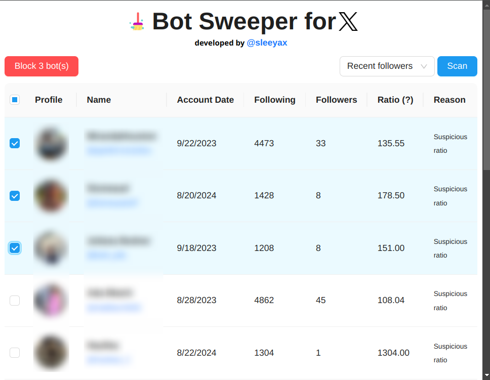

# x-bot-sweeper
Browser extension to semi-automatically block fake followers and bots on X (formerly Twitter).

This is a [Plasmo extension](https://docs.plasmo.com/) project bootstrapped with [`plasmo init`](https://www.npmjs.com/package/plasmo).



## FAQ

**Can I get in trouble for using this extension?**

No, this extension is designed to help you block fake followers and bots on X. At the time of writing, it does not violate X's TOS. However, it is important to note that the extension is not perfect and may block real users by mistake. Misconfiguration of the timeout settings may also result in temporary rate limits imposed on your account. Use this extension at your own discretion.

**Do you support [browser name]?**

Currently, only Chromium-based browsers (i.e. Chrome, Edge, Brave etc.) are supported. However, we are working on adding support for other browsers in the future. See the [project issues](https://github.com/sleeyax/x-bot-sweeper/issues?q=sort%3Aupdated-desc+is%3Aissue+is%3Aopen) tab to keep track of progress.

## Development

At the time of writing, Node.js v20 is **required** to run this project without [weird build issues](https://github.com/PlasmoHQ/plasmo/issues/1060). Please install [nvm](https://github.com/nvm-sh/nvm) to make managing Node versions easier and then run `nvm use` at the root of this project to switch to the supported version. We also strongly recommend you to use [pnpm](https://pnpm.io/) as your package manager, as it is the one we use to develop and test this project and npm has caused issues with Plasmo in the past.

Then, make sure your have the dependencies installed:

```bash
$ pnpm install
```

Finally, start the development server:

```bash
$ pnpm dev
```

Open your browser and load the appropriate development build. For example, if you are developing for the chrome browser, using manifest v3, use: `build/chrome-mv3-dev`.

You can start editing the popup by modifying `popup.tsx`. It should auto-update as you make changes. To change the options page, simply change the `options.tsx`.

For further guidance, [visit the Plasmo Documentation](https://docs.plasmo.com/)

## Production

Run the following:

```bash
$ pnpm build
```

This should create a production bundle for the extension, ready to be zipped and published to the stores.

### Publish to Webstores

The easiest way to deploy the Plasmo extension is to use the built-in [bpp](https://bpp.browser.market) GitHub action. Prior to using this action however, make sure to build your extension and upload the first version to the store to establish the basic credentials. Then, simply follow [this setup instruction](https://docs.plasmo.com/framework/workflows/submit) and you should be on your way for automated submission!
